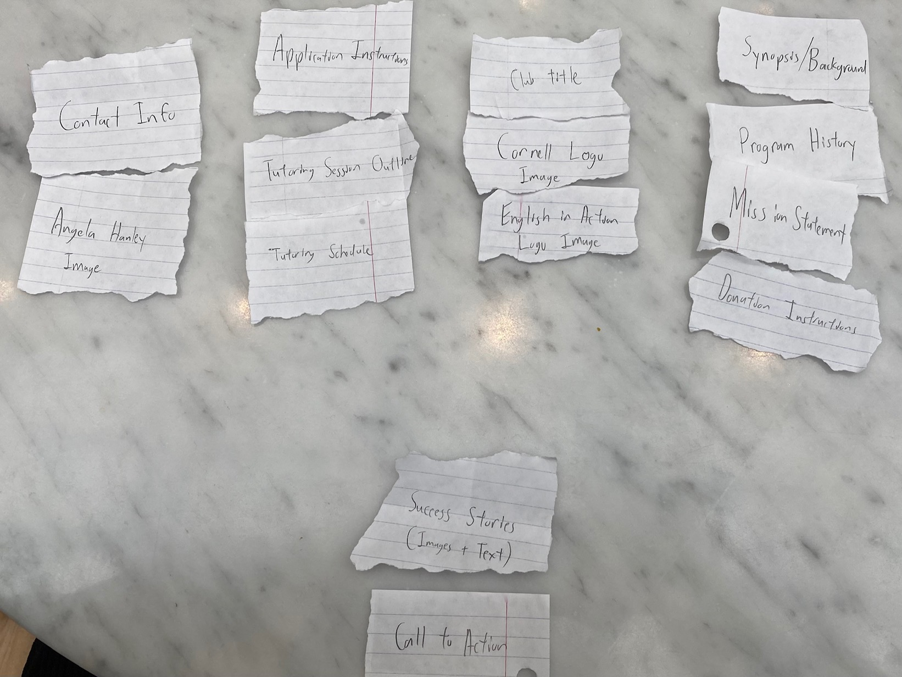
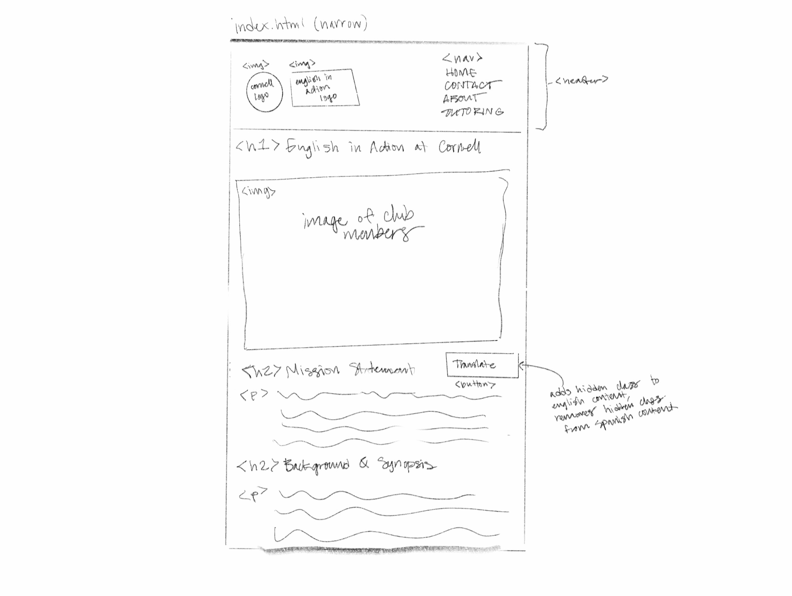
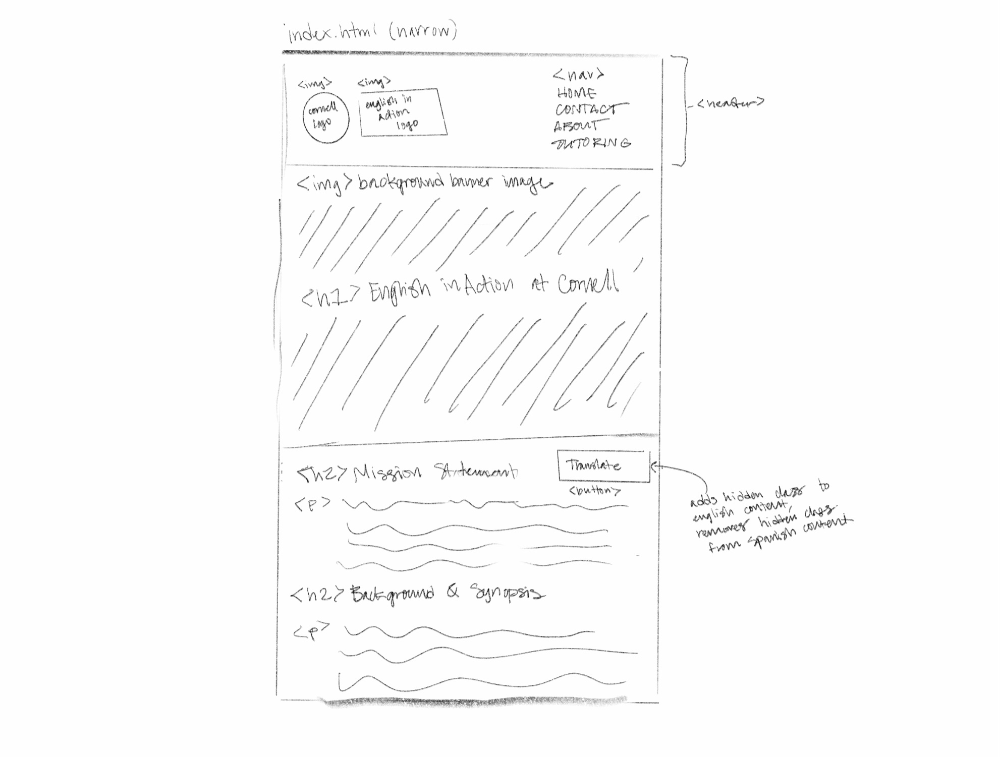

# Group Project: Design Journey

**For each milestone, complete only the sections that are labeled with that milestone.** Refine all sections before the final submission.

You are graded on your design process. If you later need to update your plan, **do not delete the original plan, leave it in place and append your new plan _below_ the original.** Then explain why you are changing your plan. Any time you update your plan, you're documenting your design process!

**Replace ALL _TODOs_ with your work.** (There should be no TODOs in the final submission.)

Be clear and concise in your writing. Bullets points are encouraged.

**Everything, including images, must be visible in _Markdown: Open Preview_.** If it's not visible in the Markdown preview, then we can't grade it. We also can't give you partial credit either. **Please make sure your design journey should is easy to read for the grader;** in Markdown preview the question _and_ answer should have a blank line between them.

## Client (Milestone 1)

### Client Description (Milestone 1)
> Tell us about your client. Who is your client?
> Explain why your client meets the client rules in the project requirements.

Our client is Nicole Collins. She is a sophomore in the College of Agriculture and Life Sciences at Cornell University. She is majoring in Atmospheric Sciences and pursuing a minor in Spanish. She is also planning on starting a club here at Cornell called English in Action so she is in need of a website.

### Client Questionnaire (Milestone 1)
> Develop a client questionnaire to learn more about your client and their goals.
> You may use the questionnaire below, you may modify the questionnaire below, or you may create your own.

1. Describe your organization and its purpose.

    Our client is creating a club here at Cornell University called English in Action at Cornell, which promotes free tutoring and practice for those who are learning English as a second language. This club is based off on an existing NGO, English in Action, that our client works with. Our client is hoping to expand the scope of this NGO to Ithaca, NY to help bring in new tutors and to help a greater amount of individuals to gain confidence in speaking English.

2. What makes your organization and its services special or unique?

    Our client believes that her club would provides a special service because it gives the NGO access to a lot of the language learning opportunities at Cornell University, which could provide greater structure to the organization and garner more support for the cause of the NGO. Our client thinks that her organization is unique because of all the opportunities for growth and expansion that it has, such as a larger scale in diversity in terms of tutors and language opportunities.

3. Why are you looking for a new website or updating your existing site?

    Our client would like to expand upon the site that already exists for the NGO, by creating one for the club here at Cornell. She believes that this addition would allow her club to better meet the audience of her club and give them more specific information as to how they can help out in Ithaca even though the NGO is located in Colorado.

4. Who do you want to visit your site? Who do you believe is your website's intended audience?

    Nicole wants her audience to be anyone who is fluent in English and willing to volunteer as a tutor for those learning the language.

5. When visiting your site, what actions do you want your visitors to take?

    Nicole wants the visitors to initially gain an understanding of what English in Action is at Cornell and in the United States as a whole on a basic level that could pique their interest in the club. On a deeper level, once visitors have an understanding of what English in Action is, Nicole hopes that if they would like to pursue supporting the club as a tutor that they can find information about how to become involved and what kind of commitment that entails. Essentially, she said, she wants it to serve as a recruitment spot for interested potential new tutors.

6. What are your goals for this site?

    Our client wants the visitors to her website to be able to contant her with any questions about the club or the NGO. She also wants them to be able to apply to be a tutor for this organization if they so wish.

7. Is there a "feel" that you want for your site? Are there colors or imagery that you have in mind?

    She wants the feel of her website to be modern and professional, yet still welcoming. She wants us to possibly mix the design aesthetic of the original organization's website and existing Cornell club websites.

8. What are your three favorite competitors or similar organizations' websites? Why?

    There are two very similar services that Cornell provides. One is the Conversational English for International Students and Scholars. This porgram is onyl for professional students and scholars, however. The other service that is simialr is Community ESL (English as a Second Language) at Cornell. This program is more similar to mine because it applies to any person in the student body, family members, visiting scholars, among other eligible groups of people. Community ESL is a free serviuce just like mine taught by volunteers in the local community who have some connection to Cornell. Another type of competitor will be more formal companies offering tutoring for English such as PrePly and Cambly. Although our ways of working are different, our market is still among people who are beginner to intermediate English speakers who are looking to imporve your proficiency in English.

### First Client Meeting Minutes/Notes (Milestone 1)
> Include your notes/minutes from your first meeting with your client.

    We met with our client for roughly 20 minutes to get an understanding of what she wants in terms of a website and who her target audience is. She gave us the link to the website for the NGO English in Action, so we would be able to gather any content and information about the organization that we may need from there: https://englishinaction.org/. We took notes inside the questionare whilst interviewing the client, and those notes can be found above based on what the client said for each question.

### Client Website (Milestone 1)
> Tell us about the website that your client wants.
> Tell us the purpose of the website and what it is all about.
> Note: **If you are redesigning an existing website, give us the current URL and some screenshots of the current site.** (FireFox makes it easy to take a full screenshot of a page from the context menu (right click).)
> If you are redesigning an existing site, tell us how you plan to update the site in a significant way that meets the project's requirements.

We intend to build an interactive and comprehensive website aimed at producing new potential tutors for the new Cornell chapter of the already thriving national organization of English in Action. Initially, we plan to have a large amount of general overview information about what English in Action is nationally, and further what it looks like at Cornell that will eb able to inform all potential visitors regardless of their goals.

### Client Goals (Milestone 1)
> Identify your client's goals for the website.
> What kind of website do they want? What are their goals for the site?
> There is no required number of goals. You need as many goals as necessary to reflect your client's desires.

- Our client wants a website that is adaptable to both narrow and wide screens.
- Our client wants the website to convince some visitors to sign up as tutors.
- Our client wants the website to give potential tutors the information they need to sign up for the club.
- Our client wants to inform any visitor of the site of the basic workings of what English in Action does.
- Our client want the website to serve as a location for tutors and tutorees to find meeting links and times for tutoring.
- Our client wants the website to show potential tutorees an oportunity to become a part of English in Action and receive its services.

### Client Website Scope (Milestone 1)
> We want your project to be successful! It needs to be ambitious, but not too large.
> A good rule-of-thumb is that you should have about 1 content-full page for each team member.
> Explain why the website you will create for your client isn't too small and isn't too big.
> Explain why you think it's the right size for this project.

Each of the four team members in our team will be responsible for a specific page in our website. We will have four pages in our website. First will be the home page which will include a brief introduction to the club as well as the services they provide. Another page will be "Our Service" which talks about what the club specializes in. The "Our Team" page will include information about the tutors as well as other people involved with the club. The last page will be the "Contact" page, which will include all information to apply as a tutor or to reach out for more information about the club. We think that this website is the right size for this project because the information included in the site will not be redundant given the needs of the site. The website will also be the right size because our client's club still does not offer many services. Therefore, the site will be the right size because it has the necessary information to recruit potential tutors as well as to start gaining exposure with people who might be interested in the club's services.

## Plan/Schedule (Milestone 1)
> Make a plan of when you will complete all parts of this assignment.
> This plan is for your team. There is no required format. Format it so that it works for you!
> Your plan should include when you will interview users and analyze their goals.
> Your plan should also include how and when you will assemble/create the sit's content.
> **Tip:** Your team should plan to work ahead. This project really isn't feasible to complete the night before a deadline.

As a team, we plan to meet after section on Fridays to go over our current progress on the milestone to ensure that we are all on track. We will make sure to clarify any questions between group members, so we will be able to complete the milestones without any last minute problems. Throughout this week, we plan on conducting our user interviews, so that we will be able to assemble content and create the website before milestone 2 due the following week.

## Understanding Users (Milestone 2)

**Make the case for your decisions using concepts from class, as well as other design principles, theories, examples, and cases from outside of class.**

You can use bullet points and lists, or full paragraphs, or a combo, whichever is appropriate. The writing should be solid draft quality, but it doesn't have to be fancy.

### User Interview Questions (Milestone 2)
> Plan the user interview which you'll use to identify the goals of your site's audience.
> You may use the interview template below and revise it as much as you desire.

**User Interview Briefing & Consent:** "Hi, I am a student at Cornell University. I'm currently taking a class on web design and for a project, I am designing the website for Nicole Collins. I'm trying to learn more about the people that might use this site. May I ask you a few questions? It will take about 10 minutes. You are free to quit at any time."

1. Please tell me a bit about yourself. You may omit any personal or private information.

2. What do you most commonly search for on the internet?

3. Are you a part of any extracurriculars at Cornell?
   1. If yes, does the extracurricular have an online platform? -> What kind? Do you use it?
   2. How did you hear about / why did you join your extracurricular?

4. Have you ever looked up a campus organization on the internet?
   1. What information were you looking for?

5.  Have you ever registered for an extracurricular / club / program online? How did you register? Did you have any difficulties in your application process?

...

n. What haven't I asked you today that you think would be valuable for me to know?

**After the interview:** "This was really helpful. Thank you so much for agreeing to speak with me today. Have a great day!"

### Interview Notes (Milestone 2)
> Interview at least 1 person for every member of your team from your audience.
> Take notes and include those notes here. Make sure to include a brief description of each interviewee.
> **Copy the interview questions above into each interviewee section below.**
> Take notes for each participant inline with the questions.

**Interviewee 1:**

1. Please tell me a bit about yourself. You may omit any personal or private information.

"I am a sophomore at Cornell marjoring in biology in the College of Agriculture & Life Sciences.

2. What do you most commonly search for on the internet?

"I usually look up guides on how to formal lab reports and essays. I also look at my college requirements and educational videos to help clarify confusing concepts from class."

3. Are you a part of any extracurriculars at Cornell?
   1. If yes, does the extracurricular have an online platform? -> What kind? Do you use it?
   2. How did you hear about / why did you join your extracurricular?

"I am a member of Bee Club. It has a website and online merch shop. I use the website to look at the new merch, since I get all the information about meetings from my email. I heard about the club at club fair, and I joined because I like bees."

4. Have you ever looked up a campus organization on the internet?
   1. What information were you looking for?

"I haven't really looked up any information for Bee Club on the internet since I get most of the information via email. Sometimes I look up organizations on the internet when I'm looking for clubs to join. I'll usually just look up "cornell clubs" and look at the student organizations directory. I will usually look for a brief synopsis about the club and then what I would need to do if I decided to join. If I decide I want to join, I'll look for an email or some instructions for how to join the organization."

5.  Have you ever registered for an extracurricular / club / program online? How did you register? Did you have any difficulties in your application process?

"I don't think I've registered for any extracurriculars online; I usually join during club fest, but I have looked at club websites that I may want to join in the future. To join these clubs, I would have to fill out a google form application that is linked on the webstie."

n. What haven't I asked you today that you think would be valuable for me to know?

"I think we covered everything."

**Interviewee 2:**

1. Please tell me a bit about yourself. You may omit any personal or private information.

"I am a junior at Cornell University studying biology. I am also an athlete. English is my second language. My first is Croatian, which I speak at home. I learned English when I was 5."

2. What do you most commonly search for on the internet?

"Probably how to convert different units for my physics class."

3. Are you a part of any extracurriculars at Cornell?
   1. If yes, does the extracurricular have an online platform? -> What kind? Do you use it?
   2. How did you hear about / why did you join your extracurricular?

"I am on the sailing team, which does not have an online platform. My friend on the team convinced me to come to Cornell and join when I was exploring colleges in high school. I joined because I had been sailing all my life."

4. Have you ever looked up a campus organization on the internet?
   1. What information were you looking for?

"Yes, sometimes I look up meeting times for campus events."

5.  Have you ever registered for an extracurricular / club / program online? How did you register? Did you have any difficulties in your application process?

"I've gone through Pavvilion's online registration process. Pavvilion is very easy to use; great platform. I would highly recommend. No difficulties."

n. What haven't I asked you today that you think would be valuable for me to know?

"Nothing."

**Interviewee 3:**

1. Please tell me a bit about yourself. You may omit any personal or private information.

"I'm a sophomore at Cornell in the hotel school and I love it. My little spin on the Cornell experience is that I'm an international student from Montreal, Canada so I've grown up in a place where English is not always the primary language, so I've always spoken French on top of English."

2. What do you most commonly search for on the internet?

"A lot of hockey videos or livestreams online, sometimes I also look up resources for some of my classes too."

3. Are you a part of any extracurriculars at Cornell?
   1. If yes, does the extracurricular have an online platform? -> What kind? Do you use it?
   2. How did you hear about / why did you join your extracurricular?

"Being from Canada, I'm unsurprisingly very involved in club hockey here at Cornell. It's funny that you ask about our online platform, I actually started an instagram account for the club hockey team this year that I manage. We've seen an awesome growth in engagement with the team jsut over the course of the semester. I originally heard about the team by looking into hockey opportunities at Cornell, and club sports are pretty prominent on campus so information was pretty easy to find on Cornell's official websites."

4. Have you ever looked up a campus organization on the internet?
   1. What information were you looking for?

"I do a lot of research on the pre-professional hotel clubs and consulting clubs. I ususally just search the internet for those keywords followed by 'at Cornell' to find them. I'm looking for what they do and how to apply because I've heard they can be helpful so I want to see how to get involved."

5.  Have you ever registered for an extracurricular / club / program online? How did you register? Did you have any difficulties in your application process?

"Not really. For club hockey I just kind of showed up at tryouts the day of and since then a lot of the communication has been over texts and emails. I haven't yet pulled the trigger on applying to professional clubs, they're pretty intimidating."

n. What haven't I asked you today that you think would be valuable for me to know?

"Seems to me like we got it all."

**Interviewee 4:**

1. Please tell me a bit about yourself. You may omit any personal or private information.
"I'm a sophomore in the Architecture, Art, and Planning program at Cornell, so I'm usually very very busy but I still love what I do."

1. What do you most commonly search for on the internet?
"I'm nearly always looking up design ideas to use as motivation, and sometimes I have to look up where I can order materials for my next project."

3. Are you a part of any extracurriculars at Cornell?
   1. If yes, does the extracurricular have an online platform? -> What kind? Do you use it?
   2. How did you hear about / why did you join your extracurricular?
"To be entirely honest, I don't really have time to do clubs. Architecture takes up a lopt of time. I guess I partipated in Dragon Day last year, but I heard about that and joined it through the program like everyone else."

4. Have you ever looked up a campus organization on the internet?
   1. What information were you looking for?
"I looked up the French club once to see if they had any interesting events coming up. I spend a lot of time with family in France so I was looking for something to remind me of being back there when I'm stuck in Ithaca."

5.  Have you ever registered for an extracurricular / club / program online? How did you register? Did you have any difficulties in your application process?
"I have not, no. Again I don't often have time to focus on things other than my classes."

n. What haven't I asked you today that you think would be valuable for me to know?
"No, I'm not sure what you're looking for exactly but I think we covered it."

### Goals (Milestone 2)
> Analyze your audience's goals from your notes above.
> List each goal below. There is no specific number of goals required for this, but you need enough to do the job (Hint: It's more than 1 and probably more than 2).

Goal 1: Learn about the club

- **Design Ideas and Choices** _How will you meet those goals in your design?_
  - In order for our audience to learn about the club, we will need to display the club's information in an intuitive and accessible manner. We will have descriptive page names that will direct the audience to the information that they are looking for, and we will include larger headers that give the user an idea of the information that that section contains so they will be able to easily find what they are looking for. We will use a readable font style and size so that the audience is able to quickly read through the content of the website. We will also include images and an image carousel where applicable.
- **Rationale & Additional Notes** _Justify your decisions; additional notes._
  - The images will give the audience information about the club that they wouldn't be able to gather through the text content, such as what the atmosphere an enviorment of the club could look like. The use of the image carousel will display these images in a compact manner to allow the user to look through images if they desire, but it will not take up too much space on the web page. As stated previously, we want to use a font style and size that is readable so we will use a combination of serif and sans-serif to create a professional and modern feel that still allows the user to find the information that they are looking for.

Goal 2: Find tutoring logistics information / Learn what tutoring entails

- **Design Ideas and Choices** _How will you meet those goals in your design?_
  - We will need to create a page entirely focused on the tutoring part of English in Action, hepling a user find more information about how ot be a tutor is essential to the goals of our website in order to grow the organization. We will on that page contian all of the information about what tutors do, like what sorts of things they will be teaching, who they will be tutoring, and what proficieciency iof different languages may be required. We will also need pretty susbtantial scheduling information as well as links to when those zoom calls will take place. ich will be met by having a link and some information about how they can submit that application next to our other contact information.
- **Rationale & Additional Notes** _Justify your decisions; additional notes._
  - We have an entire page dedicated to explaining how the tutoring works as well as a complete schedule with links to when tutor zooms take place. This should make it very easy for users to navigate to all the information they could need in order to properly learn about being tutor. By having a dedicated page that is easily navigable with text about what a tutor will achieve, and the potential time commitment, anyone who is interested in both signing up to be tutored or to be a tutor will be able to find out what that will entail and when it can occur, as well as how to make it happen.

Goal 3: Join the club as a tutor

- **Design Ideas and Choices** _How will you meet those goals in your design?_
Our website will contain all the necessary links to the forms potnetial tutors need to fill out in order to join the organization. We will have all the informaoitn they may need to justify becoming a tutor, as well as all links and information about the time commitments of being a tutor as well as the logsitics of the application. Through this, people can then reach out to English in Action with all of their desired schedules and credentials so they can join the club as a tutor.
- **Rationale & Additional Notes** _Justify your decisions; additional notes._
On the contact page where anyone looking to reach out to the club to get more inforamtion abotu becoming a tutor, we have all the information for how to apply to be a tutor. There is also all of the logistical information about tutoring on the dedicated tutoring page, meaning a user with a general interest will not only have all the logistical information for how to apply, but also for what will be asked of them if they become a tutor.

### Audience (Milestone 2)
> Briefly explain your site's audience.
> Be specific and justify why this audience is a **cohesive** group with regard to your website.

Broadly, our website targets undergraduate Cornell students who are proficient in English and may have an interest in the tutoring opportunities English in Action provides. English in Action serves a large Spanish-speaking population; our audience may be restricted even further to students who have an interest in practicing conversational Spanish. This is a cohesive group because it is a subset of the overall Cornell population that shares a common interest and is eligible to fulfill English in Action's goals of providing English tutoring.

## Website Design Exploration (Milestone 2)

Identify three websites (preferably static websites) that exist today on the web to draw inspiration from. Please select websites that are similar to the website you wish to create.

Include two screenshots of the home page for each site: narrow and wide.

**We'll refer to these are your "example websites."**

1. [English in Action](https://englishinaction.org/)

    

    

2. [Community ESL at Cornell](https://blogs.cornell.edu/communityesl/)

	

    

3. [Conversational English for International Students & Scholars](https://sce.cornell.edu/professional/program/els)

	

    

### Example Website 1 Review (Milestone 2)
> Review the website you identified above. (1 paragraph)
> In your review, include a discussion common design patterns and interactivity in the site.

The website for the NGO English in Action uses various common design patterns such as a nav bar at the top of the page along with a clickable logo. In terms of interactivity, the nav bar includes multiple drop down menus to reveal more navigation options. The nav bar also collapses into a hamburger menu when the window is narrow to take up less horizontal space, which is a common use of interactivity to implement response design. This website also has an image slideshow on the home page which is a common design practice that also utilizes interactivity. This website also uses an image carousel to display the success stories in a connected way. Another piece of interactivity on this website is the drop down menu that allows the user to switch the language of the website. Overall this website has a professional yet playful feel due to its combination of minimal sans-serif fonts and the bright colors.

### Example Website 2 Review (Milestone 2)
> Review the website you identified above. (1 paragraph)
> In your review, include a discussion common design patterns and interactivity in the site.

The Community ESL at Cornell website contains a banner that has the name of the club as well as the Cornell University logo. This banner is responsive and the text and logo becomes vertically stacked when in a narrow browser window. Another common design pattern is that this website contains an image banner just below the logo and title. Below this banner is a nav bar which is another common design pattern. This website doesn't appear to utilize interactivity other than a hamburger menu that pops up in the top right when in a narrow window. This hamburger menu doesn't contain any useful links but it is an interactive common design pattern nonetheless. This website uses mostly sans-serif fonts with black, white, and red as colors. I think this theme creates a modern feel, and the red helps tie the organization in with Cornell University.

### Example Website 3 Review (Milestone 2)
> Review the website you identified above. (1 paragraph)
> In your review, include a discussion common design patterns and interactivity in the site.

The website for Conversational English for Interantional Students & Scholars utilizes common design practices in the form of a nav bar and a side bar containing content. Interactivity is used to make the nav bar responsive by turning it into a hamburger menu in narrow browser windows. Additionally, the aside becomes vertically stacked text for narrow windows to take up less horizontal space and to use more vertical space. This website uses a combination of serif and sans-serif which creates a readable and professional feel. Something that is interesting about this website is that a "Register" button appears at the bottom of the screen whenever the "Register" button from the aside is out of view. This form of interactiviy makes it so the user is always able to register for the program regarless of where they are on the page.

## Content Planning (Milestone 2)

Plan your site's content.

### Your Site's Planned Content (Milestone 2)
> List **all** the content you plan to include your website.
> You should list all types of content you planned to include (i.e. text, photos, images, etc.)

- History (Text)
- Club synopsis / background (Text)
- Mission Statement
- Contact Information (Text)
- Contact Information (Angela Hanley - Image)
- Instructions for Applying / How to Get Involved (Text)
- Cornell Logo (Image)
- English in Action Logo (Image)
- Call to Action (Text)
- Success Stories (Images + Text)
- Tutoring Session Outline (Text + Images)
- Tutoring Schedule (Text Link to Office Hours Document)
- Donation Instructions (Text + Link to Venmo)
- Club title

### Content Justification (Milestone 2)
> Explain (about a paragraph) why this content is the right content for your site's audience and how the content addresses their goals.

The history, synopsis, mission statement, logos, and title provide general information to address the audience's goals of understanding the purpose of English in Action. The call to action and success stories will hopefully inspire the audience to consider becoming a tutor. Then, if they feel inspired or already intended to apply, application instructions and contact information will allow them to get involved easily. For existing tutors or potential tutors seeking more information, a tutoring outline and schedule may answer the question of whether or not they have time to tutor.

## Information Architecture (Milestone 2)

### Content Organization (Milestone 2)
> Document your **iterations** of card sorting here. You must have at least 2 iterations of card sorting.
> Include photographic evidence of each iteration of card sorting **and** description of your thought process for each iteration.
> Please physically sort cards; please don't try and do this digitally.

This card sort groups our site's content into 5 categories. The first is a dedicated section for contact information along with a headshot of Angela Hanley (whose contact information is listed). The second contains logistics relating to tutoring: application instructions for new tutors and a schedule for current tutors. The third group is the index page containing logos, a title, and links to other pages. The fourth is broadly "About us" which lists more information about the program, the mission statement, and instructions on how to support it via donation. The fifth section contains miscellaneous items, such as testimonials and a call to action to hook potential tutors.

The second iteration swapped content between groups 2, 4, and 5. Group 2, which contained logistics for new and existing tutors, lost the application instructions card. This separates the goals of new and existing tutors into different pages. I removed the donation instructions from Group 4 ("About us") and added success stories, which I feel shows the effectiveness of the program detailed in other cards from that group. Group 5, which used to contain miscellaneous content, now contains a call to action, application instructions, and donation instructions, enticing supporters and tutors alike.

The third iteration merged some groups and added significantly more "About us" content to the index page. The first group still contains contact information but with an additional call to action and application instructions. Potential tutors may be interested in contacting Angela, so the application is grouped with the call to action and contact information Lastly, donation information was moved back to the "About us" section, which now only provides program history, success stories, and donation instructions.

### Final Content Organization (Milestone 2)
> Which iteration of card sorting will you use for your website?

We will use the third iteration.

> Explain how the final organization of content is appropriate for your site's audiences.

The first, leftmost group contains a headshot of Angela Hanley, who will manage Cornell's organization of tutors for English in Action, contact information, application instructions, and a call to action. Our site's audience consists of students who may want to become tutors- the call to action will motivate them to fill out an application or reach out to Angela, with whom they feel more comfortable after having seen her headshot.

The second group contains information for existing tutors, who have already shown an interest in English in Action.

The third group is the index page, which provides a brief synopsis and basic information about the organization to students who may be interested. The goal of this page is to capture their attention to allow them to explore the rest of the site's content and hopefully obtain new tutors.

If the third group captures the audience's attention, they may wish to learn more and possibly support English in Action. The fourth group shows the program's past successes through testimonials and allows them to financially contribute if they feel inspired.

### Navigation (Milestone 2)
> Please list the pages you will include in your website's navigation.

- Home
- Contact
- Tutoring
- About

> Explain why the names of these pages make sense for your site's audience.

The names of these pages make sense for the audience of the website because they clearly identify the information that they would find on that page. The Home page has basic information about the club that a user may typically want to know when first visitng the site. This is a common design pattern, and so to utilize this familiarity, we decided to call this page the Home page. We called the page with the information about contacting the head of the NGO as well as our client, the Contact page because this describes what the user might want to do when visiting this page. This also adresses one of the Goals of our audience of contacting those in charge of the club. We decided to call the page that contains information and history about the club and NGO, the About page. This tile makes it clear to the user that they will be able to find any information <strong>about</strong> the club on this page. Finally we decided to call the page with the information about the tutoring process, the Tutoring page since this page contains the tutoring schedule and requirements which the audience may want to view before deciding to join the club.

## Visual Theme (Milestone 2)
> Discuss several (more than two) ideas about styling your site's theme. Explain why the theme ideas are appropriate for your target audiences. Note the theme you selected for your site and why it's appropriate for the audience and their goals.

One potential theme for the website is to model it in a similar way to the national Enlgish in Action website, with a white background superimposed with lighter gray text and some soft but bright colors like green and blue, and pictures of people smiling. This style will not only create continuity with the national website but will also make the club feel established, modern, and welcoming. This is important as we are looking to find more people who are willing to tutor and be tutored, and if the website seems complicated or intimidating it may be difficult to achieve that goal.

Another potential theme could be to make the website seem incredibly professoinal, not using a lot of colors with a very efficient layout with a serif font that is familiar to users who have been in a professional or academic setting. This would create a more businesslike setting to ensure people involved in the website are serious about tutoring and will actually be able to get the information and heplp they need to either tutor or be tutored, adding to the somewhat academic enviroment that can be associated with English tutoring. Because our audience is centered in students, they will be famliar with this setting and theme.

The first theme is more indicative of our goals, as we want our users to both feel part of a larger and more successful organization which is achieved through continuity with the national website. We also want our user to feel as though it is easy and low pressure to become a part of the club on either end, whether as a tutor, which can seem like a large and serious commitment, or to be tutored, which can sometimes feel embarassing and intimidating. By making the website full of images of smilling people, soft sans-serif fonts, and light colors, we can implement this theme of encouraging collaboration both whcih each other and the national body.

## Design (Milestone 2)

Document your site's layout.

## Interactivity Brainstorm (Milestone 2)
> Using the audience goals you identified, brainstorm possible options for interactivity to enhance the functionality of the site while also assisting the audience with their goals.
> Briefly explain idea each idea and provide a brief rationale for how the interactivity enhances the site's functionality for the audience.
> Note: You may find it easier to sketch for brainstorming. That's fine too. Do whatever you need to do to explore your ideas.

- Image carousel of success stories of English in Action, making the website easier to read without lists of images and easy to naviagte as carousels are common online
- Text carousel of success stories of English in Action,  making the website easier to read without large blocks of text and easy to navigate as carousels are common online
- Translate feature, helping many of our users who will not have strong English skills
- Image modals of tutors and tutorees appearing when clicking on certain pieces of text describing what tutoring entails
- Hamburger navigation menu that explains specifics of what is in each page to make navigation easier

### Layout Exploration (Milestone 2)
> Iterate on your site's design through sketching.
> Sketch both the narrow and wide versions of the site.
> Here you are just exploring your layout ideas. You don't need to sketch every page.
> Include some of your interactivity ideas in your sketches.
> Provide an explanation for each sketch explaining the idea and the design patterns you are leveraging.

### Exploration 1 - Wide
<!-- Source: James Kelly (Original Source) -->

For our first exploration of the home page, we looked at including a banner image below the title of the club. We thought that this could help the user get a good idea of the environment of the club immediatly after clicking on the website. In terms of design patters, we decided to use a horizontal nav bar for the wide screen next to logos in the header. In terms of interactivity we want to include a button that translates the text of the page from English to Spanish to make this page more accessible. This button would add the hidden class to all the English content and remove the hidden class from all the Spanish content.

### Exploration 1 - Narrow
<!-- Source: James Kelly (Original Source) -->

The narrow version of exploration 1 is mostly the same except the nav bar is now vertically stacked. We decided to use this common design pattern because it uses less horizontal space and more vertical space in the mobile layout. For the mobile version, we also want to shrink the size of the logos so they take up considerably less space compared to the wide layout.

### Exploration 2 - Wide
<!-- Source: James Kelly (Original Source) -->

This exploration features an image of the club members instead of the banner image. We wanted to explore this option because we thought it might take up less space and thus allow for more content. We used the same design patterns for the nav bar as the ones in Exploration 1. In this exploration, we experimented with having columns of text to make use horizontal space in the wide layout. In terms of interactivity we decided to include the Translate button that translates the text of the page from English to Spanish.This button would add the hidden class to all the English content and remove the hidden class from all the Spanish content.

### Exploration 2 - Narrow
<!-- Source: James Kelly (Original Source) -->

For the narrow version of exploration 2, we decided to remove the columns and vertically stack the content instead. This is better for narrow screens because it utilizes more vertical space. Every other element of this page remains the same as the wide exploration except for the nav bar which is now verically stacked. The logos are also considerably smaller.

### Exploration 3 - Wide
<!-- Source: James Kelly (Original Source) -->

For our third and final exploration, we decided to look at having a background banner image on the home page. We thought that this would be a good way to utilize common design practices to introduce the user to the website. This backround image would also take up less space than the image in the first exploration because the text is placed over the image. We once again utilized the horizontal nav bar in the header with the logos. We once again included the interactive translate button to allow the user to traslate the text on the home page from English to Spanish.

### Exploration 3 - Narrow
<!-- Source: James Kelly (Original Source) -->

The narrow version of exploration 3, is mostly the same except the logos in the header are smaller and the nav bar is now verticallly stacked. We still decided to include the Translate button and the background image for the reasons stated in the previous explanation.

### Final Design (Milestone 2)
> Include the final sketches for each of your pages.
> **Include your final interactivity in your sketches.** Include annotations to explain what happens when the user takes an action with your interactivity.
> The sketches must include enough detail that another 1300 student could implement them.
> However, you don't need to provide layout/CSS annotations.
> Please, provide an explanation for each sketch.

**Narrow (Mobile) Design:**

<!-- Source: James Kelly (Original Source) -->

We decided to base the final sketch for our home page off of the third exploration sketch. We liked the background image and header. We kept most if this sketch exactly the same as exploration 3. In terms of interactivity we want to include a button that translates the text of the page from English to Spanish to make this page more accessible. This button would add the hidden class to all the English content and remove the hidden class from all the Spanish content. We want to include this interactivity on the home page to possibly help users who may navigate to our site on accident when they are looking for the official NGO website. The official NGO website is where users go if they want to sign up as a tutor or student, but our website's audience is only potential tutors.

<!-- Source: James Kelly (Original Source) -->

For the contact page, we decided to keep the same header as the home page to create continuity throughout the webstie. The nav bar is vertically stacked and the logos are smaller than they would be in the wider version.We also vertically stacked all the content once again to optimize the vertical space.

<!-- Source: James Kelly (Original Source) -->

The header is kept the same throughout our website utilizng common design patters for narrow screens. We once again vertically stacked all of our content to make the most of the narrow screen. In terms of interactivity, we wanted to include an image and text carousel to highlight the sucess stories of the NGO in a way that doesn't take up too much space. The iamge carousel allows us to hide majority of the content unless the user decides they want to look at it. If they decide this, then they can easily click through the other success stories. Our image and text carousel is vertically stacked in the narrow layout making it omptimalize the vertical space.

<!-- Source: James Kelly (Original Source) -->

The header is the same for the tutoring final page as it is for the other pages. This header utilizes common design patters such as a vertically stacked nav bar, so we wanted to continue it throughout the website to create continuity. We once again used vertically stacked content to make the most of the narrow layout.

**Wide (Wide) Design:**

<!-- Source: James Kelly (Original Source) -->

The final sketch for the wide home page is similar to the one explored in exploration 3. In the final sketch however, we decided to create two columns of text to make the most of the horizontal space. In terms of interactivity, we will include the translate button which would allow the user to translate the home page into Spanish if they desire to do so. The nav bar is similar to the one explored in the narrow layout, but for the wide layout, we want to use a horizontal nav bar and larger logos to take up the horizontal space. We still want to include the background banner image with the club name imposed on top of it.

<!-- Source: James Kelly (Original Source) -->

For the wide version of the contact page, we want to create two colums of content to utilize the horizontal space. We want to keep the Call to action above and seperate from the two columns. The header will be the same as the header used in the home page. This header utilizes common design patterns and we want to include it throughout our website on the wide displays to create continuity.

<!-- Source: James Kelly (Original Source) -->

The final wide sketch for our about page also uses the horizontal version of the header that utilizes more horizontal space. This page includes the image carousel which will function the same as it does on the narrow window, but on wide screens, the text in the carousel will appear to the right of the image instead of below it to utilize more of the horizontal space.

<!-- Source: James Kelly (Original Source) -->

The wide version of the tutoring page utilizes the same horizontal header that has been used throughout the website. This page will include two columns of content as well to once again optimalize the horizontal space. We want to include some sort of image on this page to break up the large amount of text and to provide a visual of either the tutoring process or schedule to the audience.

### Design Rationale (Milestone 2)
> Explain why your design is appropriate for your audience.
> Specifically, why does your content organization, navigation, and site design/layout meet the goals of your users?
> How did you employ **design patterns** to improve the familiarity of the site for your audience?

Our webpage follows traditional website design practices of having the general logo adn title of English in Action at the top of every page, along with the navigation tab between different pages in order for the website to be clear and easy to navigate for all of our users, some of whom may not be strong English speakers. Furthermore, our website is then divided to contain both all of the necessary logistical content like contact informatoin, application information, scheduling, and our mission statement, but it also contains some fluff content. This fluff content, like program history and success stories, helps develop a relatoinship between the audience and the club, so the audience will see the club as a strong and legitimate organizatoin that they want to be a part of, but also eases up the seriousness of tutoring to put the audience further at ease. We also have a lot of photos, especially on the success story section, to add visual aid and break up significant text blocks whilst also showing users how the organization works without just telling them. Photos also helpl communicate with users who may not have confidence in their ability to read the text of the site, which includes certain sets of our intended audience. Overall, we are all able to deliver necessary inforamtion in a personable manner in order to spread word about the club and have people join it.

## Interactivity Rationale (Milestone 2)
> Describe the purpose of your proposed interactivity.
> Provide a brief rationale explaining how your proposed interactivity addresses the goals of your site's audience and enhances their user experience.

The interactivity we propose is focused largely on a joint image and text carousel for the stories of past tutoring pirs to best demostrate with both visual and text information how tutoring works and how successful it is. This addresses one goal of making the website welcoming, as the photos are professionally taken and show happy and successful tutoring partnerships, which will both show users that we are a successful and legitimiate organization, but also cuts out text blocks and makes the user feel more welcomed and less intimidated by joining a tutoring organization. The translate feature will also be one of the final pieces of interactivity used and is mostly foucsed on helping out our audience that is looking to be tutored and may not have strong English skills. It will be intuitive to use but also will help these users feel less daunted by tutoring, as if they cannot fully comprehend the English of the website they will feel perfectly comfrotable setting up appointments and learning abotu the club in their native language. Both sets of interactivty will help our audience both understand the purpose of our club better, and also make them feel more comfortable making a decision to join it, which is the main goal of the English in Action Cornell website.

## Interactivity Plan (Milestone 2)
> Now that you've designed your interactivity for your site, you need to plan how you will implement it.
> Describe how you will implement the interactivity. This should be a complete plan that another 1300 student could use to implement the interactivity.
> You should list the HTML elements, CSS classes, events, pseudocode, and the initial state.

For the image and text carousel: Using class "imgcarousel" for all button, img, h2, and p elements that are a part of the carousel. The button elements representing the arrows have class "arrow" and are an image of an arrow. Each section containing the text and the image of people is part of its own figure element of class "slide" if it is shown and class "slide hidden" if it is hiden, and each figure set has a unique id "figuren" where n is the number it is in the carousel. When an arrow button is clicked, the current figure loses class "slide" and gains class "slide hidden" and the figure with the next highest n slide ID is then given class "slide" meaning it is shown on the screen. If the reverse arrow is pressed, the figure with the ID of n value one lower will be given "slide" class, showing it on the screen.
Psuedocode:
when button class "button" is pressed{
    remove class "slide" from currently shown figure
    add class "slide hidden" from currently shown figure
    remove class "slide hidden" from figure with next slide ID
    add class "slide" to figure with next slide ID
}
when button class "back-button" is pressed{
    remove class "slide" from currently shown figure
    add class "slide hidden" from currently shown figure
    remove class "slide hidden" from figure with previous slide ID
    add class "slide" to figure with previous slide ID
}

For the translate button:
Using ID tenglish and tspanish on two separate HTML buttons named English and Espanol, we will listen for a button press and then when the button corresponding to a specific language is pressed, the current text will gain class "hidden" and will be hidden. The other language text will lose class "hidden" and be shown. Additionally, each button gains class hidden when the language they create is on screen. For example, if the english text is on screen, then the english button is hidden so there is only ever one button on screen at a time.
Psuedocode:
when button ID tenglish is pressed{
    remove class "hidden" from class "english"
    add class "hidden" to class "spanish"
}
when button ID tspanishh is pressed{
    remove class "hidden" from class "spanish"
    add class "hidden" to class "english"
}

## Client Feedback & Minutes (Milestone 2)
> You should meet with your client again to obtain feedback on your design.
> Provide a summary of the client's feedback and your meeting's minutes.

Client thought the translation feature was very helpful but needed polishing before final push. She likes how we took some information from the national website in order to maintain ties with the organization but also had a Cornell spin on a lot of the content. Client said finding some application information was slightly unintuitive but ultimately easy enough to go through to the final version of the site.

Us: "Here is an initial version of the site. Click through all the pages and let us know what you think of the design theme"
Client spends a couple of minutes tinkering around with the website.
Client: "I think there are some pieces of the website, notably application information, that could be slightly easier to find. I ended finding all the pieces of information that are absolutely necessary like the schedule and contact links, but some of them were slightly inuintitive. At the end of the day though, everything that is absolutely necessary is present and finding it isn't too difficult."
Us: "What do you think about the theming and look of the website?"
Client: "I think the general theme that it looks like you are going for is really accurate comparative to the national website, and I think that's a good choice. Obviously layout needs some polishing but the colors are good and I like the Cornell stuff that you added to give it a local flair."
Us: "Try the translate feature and let us know what you think."
Client translates to Spanish and back to english.
Client: "I didn't expect this much stuff on the website! I like the idea but it seems a little clunky and could use some stylizing. But that's a really good idea.
Us: "Any other comments?"
Client: "Just polish it up a bit more, I'm happy with this draft!'

## User Testing (Final Submission)

**Conduct user testing with a minimum of 1 participant for every member of your team.**

### User Testing Tasks (Final Submission)
> Plan out your user testing tasks before doing your user testing.
> These must be actual user testing tasks.
> **Tasks are not questions!**

1. Find the contact info for the correct person to learn about joining English in Action.

2. Find what year Polly became a tutor for English in Action.

3. Find the tutors working the next three sessions.

4. Read two different English in Action success stories.

### Participant 1 (Final Submission)
> Using your notes from above, describe your user by answering the questions below.

1. Who is your user, e.g., where does the user come from, what is the user's job, characteristics, etc.?

    My user is Richard Kelly, a junior Dyson student at Cornell University with family in Central America interetsed in helping those native in Spanish to become more confident with their English.

2. Does the user belong to your audience of the site?

    > If No, whats your strategy of associating the user test results to your audiences needs and wants? How can your re-design choices based on the user tests make a better fit for the audience?

   Yes

### Participant 1 -- Testing Notes (Final Submission)
> When conducting user testing, you should take notes during the test.

Asked the user to find the contact info for the correct person to learn about joining English in Action. User navigated to the "Contact" page and immediately found the email address of both Angela and Nicole, and also read that he can contact either of them if he's interested in becoming a tutor.
Asked the user to find what year Polly became a tutor for English in Action. User naviagated to the "Home" page and read through all text but did not find any information about Polly. User then naviagted to the "About" page and read about Aaron and Elmer before clicking through all of the carousel images to find the one with Polly. Reading the blurb, the user discovered that Polly became a tutor in 1995.
Asked the user to find the tutors working the next three sessions. User immediately navigated to the "Tutoring" page and looked at the graph displayed. However, he only could see the tutors for the next session as that is the only one displayed on the example graph. He was briefly confused but eventually read the "Tutoring Schedule" header and clicked the link to the full schedule and found the names of the tutors for the next three sessions on the first page.
Asked the user to read two different English in Action success stories. He intially says he already has read two after looking for the year that Polly became a tutor, but then navigates back to the "About" page and clicked through the image carousel to find 3 different success stories and read them.
Told user that he has successfully completed the tasks, and thanked him for his time and cooperation.

### Participant 2 (Final Submission)
> Using your notes from above, describe your user by answering the questions below.

1. Who is your user, e.g., where does the user come from, what is the user's job, characteristics, etc.?

    Participant is Sarah Andrews, a freshman studying English at the University of Vermont interested in bringing English in Action to her campus.

2. Does the user belong to your audience of the site?

    > If No, whats your strategy of associating the user test results to your audiences needs and wants? How can your re-design choices based on the user tests make a better fit for the audience?

    Yes.

### Participant 2 -- Testing Notes (Final Submission)
> When conducting user testing, you should take notes during the test.

Asked the user to find the contact info for the correct person to learn about joining English in Action. User looked at the Navigation Bar for a moment and then navigated to the "Contact" page and immediately found the email addresses needed if interested in becoming a tutor. She noted that she may reach out to Angela for help developing a chapter at her Univeristy as the website says Angela works with the national organization.
Asked the user to find what year Polly became a tutor for English in Action. User immediately naviagted to the "About" page and looked at the names of the people in the first success story before clicking through all of the carousel images to find the one with Polly. Reading the blurb, the user noted that Polly became a tutor in 1995.
Asked the user to find the tutors working the next three sessions. User first went to the "Home" page but realized the tutoring scheudle is not present and then naviagted to the "Tutoring" page. She then saw the schedule and looked at the dates and realized it is for the ucrrent month and the future dates were not present. She then clicked the link to the full schedule and found the dates and names for the next month of tutoring sessions
Asked the user to read two different English in Action success stories. User quickly navigated back to the "About" page and clicked through the image carousel and read each story, noting how she was now more enthusiatic about bringing English in Action to the University of Vermont.
Told user that she has successfully completed the tasks, and thanked her for her input and effort

### Participant 3 (Final Submission)
> Using your notes from above, describe your user by answering the questions below.

1. Who is your user, e.g., where does the user come from, what is the user's job, characteristics, etc.?

   Participant is Jackson Douglas, a sophomore Operations Reseach student who is not very involved across campus looking to spend his time doing something tangible and heard about English in Action through his dorm mates.

2. Does the user belong to your audience of the site?

    > If No, whats your strategy of associating the user test results to your audiences needs and wants? How can your re-design choices based on the user tests make a better fit for the audience?

    Yes.

### Participant 3 -- Testing Notes (Final Submission)
> When conducting user testing, you should take notes during the test.

Asked the user to find the contact info for the correct person to learn about joining English in Action. User read through the home page and the navigated to the "Contact" page and read through the entire page, noting how it is nice that there are national organization members guiding the emergence of the Cornell chapter. He did not before know how new English in Action was, but did find the correct emails needed to become a tutor.
Asked the user to find what year Polly became a tutor for English in Action. User had already read the home page so he knew that Polly's information was not there. He then naviagted to the "Tutoring" page and saw Polly listed on the schedule, but couldn't find any information about her so he then naviagted to the "About" page and clicked through all of the carousel images to find the one with Polly. Reading the blurb, the user discovered that Polly became a tutor in 1995. He noted that he liked the quality on the photos.
Asked the user to find the tutors working the next three sessions. User immediately navigated back to the "Tutoring" page re-read the schedule. He didn't find past the next session, so he clicked the link to the full schedule document and found the names of the tutors for the next three sessions and then scrolled down and realized that the organization has been functioning for several years and all the information is still on the schedule.
Asked the user to read two different English in Action success stories. User naviagted back to the about page and read the inital default story about Aaron and Elmer and then clicked through to read about Polly again.
Told user that he has successfully completed the tasks, and thanked him for his consideration.

## Website Revision Based on User Testing (Final Submission)
> What changes did you make to your design based on user testing?

Users were very reliant on the nav bar, however we only had user testing for the website as a desktop site, so in order to maintain strength on the navigation bar for a mobile device we made the navigation bar into a hamburger menu which is easily navigable on mobile sites. Additionally, to make the contact page more clear and have the email for the national ambassador Angela more front and center to make it easier for users to understand who is best person to contact and require less scrolling on the website contact page. We also made the photos into circles instead of rectangles to make the page more visually appealing.

## Grading (Final Submission)

### Collaborators (Final Submission)
> List any persons you collaborated with on this project.

We did not collaborate with anyone on this project execpt for our client Nicole Collins.

### Reference Resources (Final Submission)
> Please cite any external resources you referenced in the creation of your project.
> (i.e. W3Schools, StackOverflow, Mozilla, etc.)

- [Mozilla Documentation](https://developer.mozilla.org/en-US/)
- [Emoji Guide](https://emojiguide.org/)
